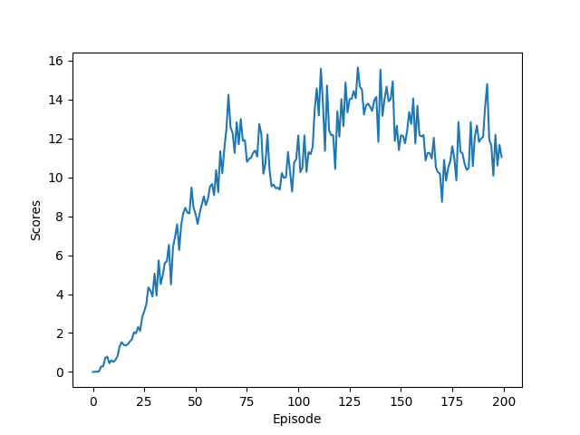

[//]: # (Image References)

[image1]: https://user-images.githubusercontent.com/10624937/43851024-320ba930-9aff-11e8-8493-ee547c6af349.gif "Trained Agent"
[image2]: https://user-images.githubusercontent.com/10624937/43851646-d899bf20-9b00-11e8-858c-29b5c2c94ccc.png "Crawler"


# Project 2: Continuous Control

### Introduction

For this project, you will work with the [Reacher](https://github.com/Unity-Technologies/ml-agents/blob/master/docs/Learning-Environment-Examples.md#reacher) environment.

![Trained Agent][image1]

In this environment, a double-jointed arm can move to target locations. A reward of +0.1 is provided for each step that the agent's hand is in the goal location. Thus, the goal of your agent is to maintain its position at the target location for as many time steps as possible.

The observation space consists of 33 variables corresponding to position, rotation, velocity, and angular velocities of the arm. Each action is a vector with four numbers, corresponding to torque applicable to two joints. Every entry in the action vector should be a number between -1 and 1.

### Distributed Training

For this project, we will provide you with two separate versions of the Unity environment:  
- The first version contains a single agent.
- The second version contains 20 identical agents, each with its own copy of the environment.  

### Solving the Environment

#### Option 1: Solve the First Version

The task is episodic, and in order to solve the environment,  your agent must get an average score of +30 over 100 consecutive episodes.

#### Option 2: Solve the Second Version

The barrier for solving the second version of the environment is slightly different, to take into account the presence of many agents.  In particular, your agents must get an average score of +30 (over 100 consecutive episodes, and over all agents).  Specifically,
- After each episode, we add up the rewards that each agent received (without discounting), to get a score for each agent.  This yields 20 (potentially different) scores.  We then take the average of these 20 scores. 
- This yields an **average score** for each episode (where the average is over all 20 agents).

The environment is considered solved, when the average (over 100 episodes) of those average scores is at least +30.   


### Getting Started
1. Follow instruction here [click here](https://github.com/udacity/deep-reinforcement-learning#dependencies) to set up your Python environment with unityagents.  

2. Download the environment from one of the links below.  You need only select the environment that matches your operating system:

    - **_Version 1: One (1) Agent_**
        - Linux: [click here](https://s3-us-west-1.amazonaws.com/udacity-drlnd/P2/Reacher/one_agent/Reacher_Linux.zip)
        - Mac OSX: [click here](https://s3-us-west-1.amazonaws.com/udacity-drlnd/P2/Reacher/one_agent/Reacher.app.zip)
        - Windows (32-bit): [click here](https://s3-us-west-1.amazonaws.com/udacity-drlnd/P2/Reacher/one_agent/Reacher_Windows_x86.zip)
        - Windows (64-bit): [click here](https://s3-us-west-1.amazonaws.com/udacity-drlnd/P2/Reacher/one_agent/Reacher_Windows_x86_64.zip)

    - **_Version 2: Twenty (20) Agents_**
        - Linux: [click here](https://s3-us-west-1.amazonaws.com/udacity-drlnd/P2/Reacher/Reacher_Linux.zip)
        - Mac OSX: [click here](https://s3-us-west-1.amazonaws.com/udacity-drlnd/P2/Reacher/Reacher.app.zip)
        - Windows (32-bit): [click here](https://s3-us-west-1.amazonaws.com/udacity-drlnd/P2/Reacher/Reacher_Windows_x86.zip)
        - Windows (64-bit): [click here](https://s3-us-west-1.amazonaws.com/udacity-drlnd/P2/Reacher/Reacher_Windows_x86_64.zip)
    
    (_For Windows users_) Check out [this link](https://support.microsoft.com/en-us/help/827218/how-to-determine-whether-a-computer-is-running-a-32-bit-version-or-64) if you need help with determining if your computer is running a 32-bit version or 64-bit version of the Windows operating system.

    (_For AWS_) If you'd like to train the agent on AWS (and have not [enabled a virtual screen](https://github.com/Unity-Technologies/ml-agents/blob/master/docs/Training-on-Amazon-Web-Service.md)), then please use [this link](https://s3-us-west-1.amazonaws.com/udacity-drlnd/P2/Reacher/one_agent/Reacher_Linux_NoVis.zip) (version 1) or [this link](https://s3-us-west-1.amazonaws.com/udacity-drlnd/P2/Reacher/Reacher_Linux_NoVis.zip) (version 2) to obtain the "headless" version of the environment.  You will **not** be able to watch the agent without enabling a virtual screen, but you will be able to train the agent.  (_To watch the agent, you should follow the instructions to [enable a virtual screen](https://github.com/Unity-Technologies/ml-agents/blob/master/docs/Training-on-Amazon-Web-Service.md), and then download the environment for the **Linux** operating system above._)

3. Clone this GitHub repository, and add the environment files in the data folder (data/Vis, data/NoVis) accordingly.

### Instructions  

Step 1. Pre-train network on **CPU** with **1 x BATCH_SIZE** update
```
$ python MultiAgents_Train1.py
```

Step 2. Load a pre-train network on **GPU** to continue with **2 x BATCH_SIZE** update
```
$ python MultiAgents_Train2.py
```
Note: **This project implements option 2 (20 agents).**  

### Results

Train 1:
```
Episode 10	Average Score: 0.32
Episode 20	Average Score: 0.77
Episode 30	Average Score: 1.52
Episode 40	Average Score: 2.46
Episode 50	Average Score: 3.55
Episode 60	Average Score: 4.42
Episode 70	Average Score: 5.43
Episode 80	Average Score: 6.21
Episode 90	Average Score: 6.73
Episode 100	Average Score: 7.07
Episode 110	Average Score: 8.21
Episode 120	Average Score: 9.38
Episode 130	Average Score: 10.47
Episode 140	Average Score: 11.31
Episode 150	Average Score: 11.88
Episode 160	Average Score: 12.27
Episode 170	Average Score: 12.23
Episode 180	Average Score: 12.14
Episode 190	Average Score: 12.20
Episode 200	Average Score: 12.38
```



Train 2 (continue from 1):
```
Episode 10	Average Score: 1.01
Episode 20	Average Score: 3.35
Episode 30	Average Score: 5.39
Episode 40	Average Score: 7.13
Episode 50	Average Score: 8.62
Episode 60	Average Score: 10.21
Episode 70	Average Score: 11.52
Episode 80	Average Score: 12.66
Episode 90	Average Score: 13.94
Episode 100	Average Score: 15.15
Episode 110	Average Score: 18.02
Episode 120	Average Score: 20.64
Episode 130	Average Score: 23.07
Episode 140	Average Score: 25.12
Episode 150	Average Score: 26.96
Episode 160	Average Score: 28.31
Episode 170	Average Score: 29.46
Episode 176	Average Score: 30.08
Environment solved in 176 episodes!	Average Score: 30.08
```


### DDPG Implementation Details

Further information regarding to the implementation can be found in [Report.md](./Report.md)   


