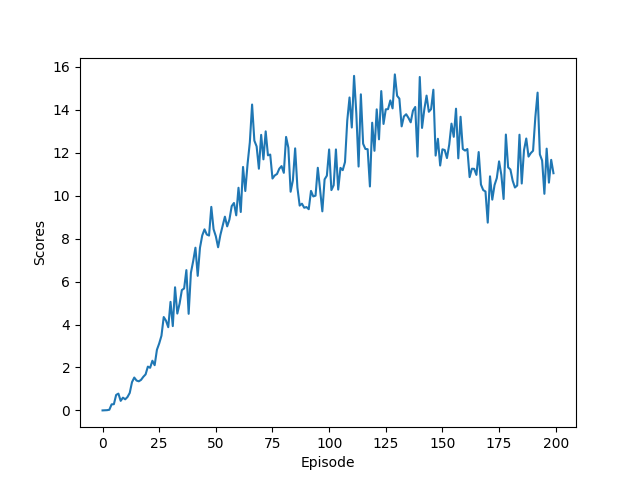
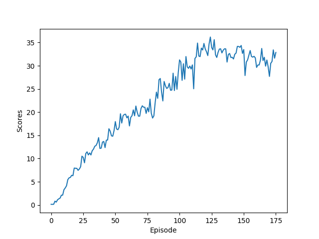

# Project 2: Reacher (Continuous Control)

### Introduction
DDPG(Deep Deterministic Policy Gradients) has been used to solve this reacher environment in continous spaces. In this DDPG, there is an actor and a critic network each of which has a local and target, similar to DQN (Deep Q-Network) reinforcement learning. The actor network is learning to estimate the optimal actions which will be validated by the critic network during training to improve the actor (local)network.   

Actor network: Input:states | Output:actions  
Critic neowk: Input:states,action | Output: Q action value  

**Q Network**  
The network is defined in `model.py`. In this reacher environment, we are using 3 fully connected layers with RELU, tanh activation.  
By default, the actor and critic has a similar network. it has input and output of each layer as follows.  

`Actor`
```
input layer:  Relu(linear[state_size, 128])  
hidden layer: Relu(linear[128, 128])  
output layer: tanh([128, action_size])   

`Critic`
```
input layer:  Relu(linear[state_size, 128])  
hidden layer: Relu(linear[concat(128, action_size), 128])  
output layer: linear[128, 1]   


**Algorithm**  
DDPG learning is acheived by interacting, learning and updating the actor and critic network as follows:  

Step 1. Interacting with the environment on the current actor policy

Step 2. Add states, actions, rewards, next_states, dones to the ReplayBuffer

Step 3. DDPG Actor/Critic learning `line 91 in ddpg_agen.py (learn function)`  

* Update critic (local) network by minimising loss
```
Q_targets = r + gamma * critic_target(next_state, actor_target(next_state))
Q_expected = critic_local(states, actions)

```

* Update actor (local) network by maximising the expect return of Q
```
actor_loss = -critic_local(states, actor_local(states)).mean()

``` 

* Soft update: critic/actor (target) network  
```
target = tau * local + (1.0 - tau) * target

```

### Learning  
In this repository, there are 3 files used for training the agents as follows.  

**MultiAgents_Train1.py, MultiAgents_Train2.py** is the main routine to create the environment, the agent and the training.   

**ddpg_agent** is the DDPG algorithm to update the Q network in both a local and a target network. Replay buffer and OUNoise for actions.

**model.py** is the Q network definition.   


**Hyperparametrs**  
```
BUFFER_SIZE = int(1e5)  # replay buffer size  
BATCH_SIZE = 128        # minibatch size  
GAMMA = 0.99            # discount factor  
TAU = 1e-3              # for soft update of target parameters  
LR_ACTOR = 1e-4         # learning rate of the actor  
LR_CRITIC = 1e-4        # learning rate of the critic  
WEIGHT_DECAY = 0        # L2 weight decay  
TARGET_UPDATE = 1       # updating target networks every N steps  
```
**Training on 20-Agent environment**
Step 1. Pre-train network on **CPU** with **1 x BATCH_SIZE** update
```
$ python MultiAgents_Train1.py
```

Step 2. Load a pre-train network on **GPU** to continue with **2 x BATCH_SIZE** update
```
$ python MultiAgents_Train2.py
```

### Plot of Rewards    
**Agent Train 1 Scores** (1 x BATCH_SIZE update on CPU)  
  

```
Episode 10	Average Score: 0.32
Episode 20	Average Score: 0.77
Episode 30	Average Score: 1.52
Episode 40	Average Score: 2.46
Episode 50	Average Score: 3.55
Episode 60	Average Score: 4.42
Episode 70	Average Score: 5.43
Episode 80	Average Score: 6.21
Episode 90	Average Score: 6.73
Episode 100	Average Score: 7.07
Episode 110	Average Score: 8.21
Episode 120	Average Score: 9.38
Episode 130	Average Score: 10.47
Episode 140	Average Score: 11.31
Episode 150	Average Score: 11.88
Episode 160	Average Score: 12.27
Episode 170	Average Score: 12.23
Episode 180	Average Score: 12.14
Episode 190	Average Score: 12.20
Episode 200	Average Score: 12.38
```



**Agent Train 2 Scores** (continue from Train 1 with 2 x BATCH_SIZE update on GPU)  
  
Train 2 (continue from 1):
```
Episode 10	Average Score: 1.01
Episode 20	Average Score: 3.35
Episode 30	Average Score: 5.39
Episode 40	Average Score: 7.13
Episode 50	Average Score: 8.62
Episode 60	Average Score: 10.21
Episode 70	Average Score: 11.52
Episode 80	Average Score: 12.66
Episode 90	Average Score: 13.94
Episode 100	Average Score: 15.15
Episode 110	Average Score: 18.02
Episode 120	Average Score: 20.64
Episode 130	Average Score: 23.07
Episode 140	Average Score: 25.12
Episode 150	Average Score: 26.96
Episode 160	Average Score: 28.31
Episode 170	Average Score: 29.46
Episode 176	Average Score: 30.08
Environment solved in 176 episodes!	Average Score: 30.08
```


### Evaluation
```
$ python Play_Env.py
:
:
Accumulated Score: 35.79
Accumulated Score: 35.83
Accumulated Score: 35.87
Accumulated Score: 35.91
Accumulated Score: 35.94
Accumulated Score: 35.98
Accumulated Score: 36.02
Accumulated Score: 36.06
```

### Future Improvements
In this project, the basic DDPG is used. For further improvement in order to learning faster and to achieve a better scores. We could implement  
1. Batch normalisation to reduce a major variation in states that may cause a big weight update.  
2. Cooperate epsilon greed policy to improve exploration and exploitation dilemma in addition to adding noise to the actions alone.
3. Prioritized Experience Replay to improve the efficiency of experience replay in DDPG method by replacing the original uniform experience replay with prioritized experience replay.


